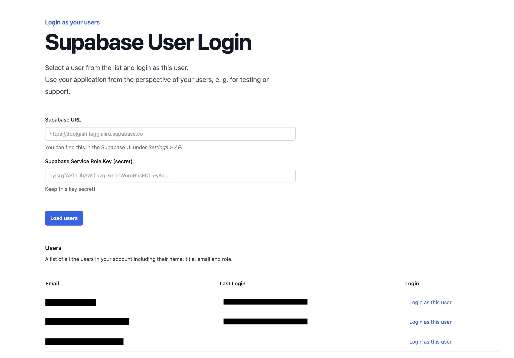

# Supa User Login

> Log in as a user of your Supabase app

Sometimes it can be helpful to see your app exactly like one of your actual users sees it:

-   UX / UI checks
-   Debugging real-world edge cases
-   Live 1:1 support sessions ("Let's look at your account together")

Live app: [supa-user-login.vercel.app](https://supa-user-login.vercel.app/)



### User editing feature

* Changing a user's email – not possible through the Supabase dashboard, so this is a useful tool to do it. The email changed in this way will be automatically confirmed *without* the user needing to click a link in an email.

## Run locally

1. Clone this repository and navigate into its folder

2. Install dependencies

```
npm install
```

3. Start the app

```
npm run dev
```

4. Open https://localhost:8080 in your browser
